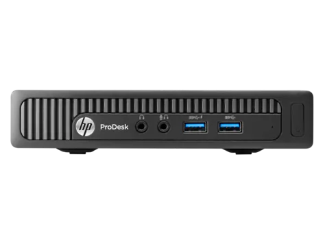
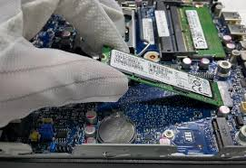

# HP ProDesk 400 G2 DM 
## Big Sur 

## Configuration

| Specifications | Details                                          |
| ------------------- | ------------------------------------------- |
| Computer model      | HP Prodesk 400 G2 DM      					|
| Processor           | Intel(R) Core(TM) i3-6100T CPU @ 3.20GHz    |
| Graphics			  | Intel HD Graphics 530                  		|
| Sound Card          | Realtek ALC221 (layout-id:11/15)            |
| Ethernet		      | Realtek RTL8111 PCIE                        |
| WiFi		          | Intel 7265 m.2                          	|
| RAM		          | 16GB                                     	|

## Improvements

- This version was prepared using OpenCore 0.6.9 for MacOS Big Sur.
- SSDT was generated for i3-6100T. Use https://github.com/Piker-Alpha/ssdtPRGen.sh to optimize yours CPU power management and then paste it into EFI/OC/ACPI/ssdt.aml
## Working / Fixed; 

+ USB 
+ Sound 
+ Fixed Airplay screen mirroring - black screen with mouse cursor (Skylake isue) 
+ iMessages
+ Wifi and Ethernet
+ M.2 Pcie SSD 
+ Fixed RTC error on restart 

## Installation

- First of all, go to the UEFI settings and disable the serial port. Upgrade the BIOS to the newest possible version (currently the newest version is version no. [00.02.56, Rev.A](https://ftp.hp.com/pub/softpaq/sp96001-96500/sp96015.exe) which was released on the 30th of April 2019).
- Copy OpenCore to EFI partition or USB drive. In contrast to Clover, you need to have BOOT\bootx64.efi file.
- Simply put your Big Sur install USB into any port and select Install macOS option in OpenCore.

- Durning installation if you nead ethernet and is disconected use terminal to set proper media type. Script is located under /EFI/network_UP_script 

### Issues
+ Display Port Audio output isn't working
+ Sleep 